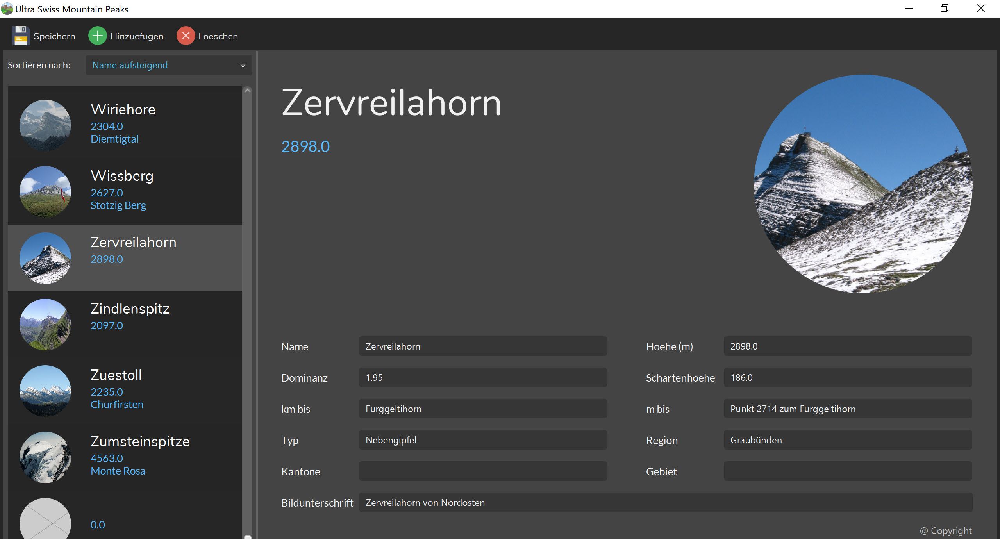

# Swissmountains (Java und JavaFX Management-Software)

## Applikation
Während dem 2. Semester (Bachelor in Informatik, iCompetence) realisierten wir eine Management-Software für Schweizer Berge auf Basis von JavaFX. 

## Demo Video
https://youtu.be/mDUd6J-GjqQ

## Projektteam
Manuel Riedi & Linus Kohler

